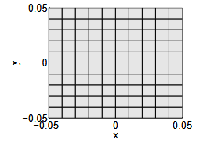
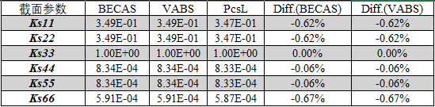
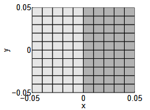
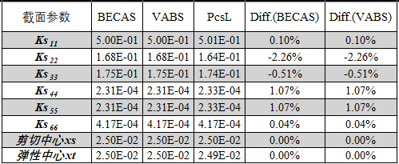
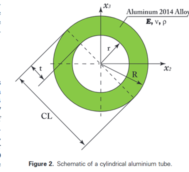
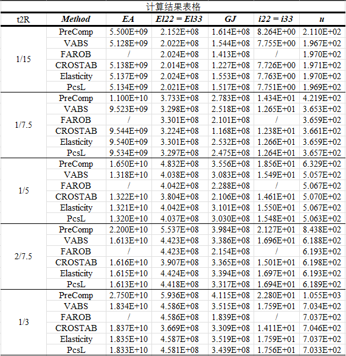
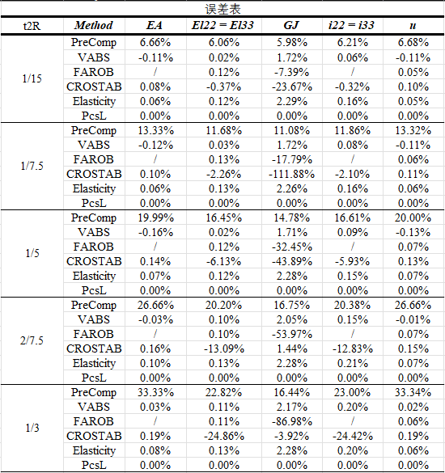

## HawtC.PCS

Beta V2.0.014及其之后的HawtC以及PcsL版本支持FEM方法计算截面特性以及翼型网格自动化算法。

需要注意的是：PCS的算法分为经典层压板理论和有限元方法，层压板的代码完全是PreComp的c#版本。但有限元方法是我们自己开发的代码。为了方便用户，我们参考了PreComp的输入文件

并对其进行了二次开发。下面我们给出PCSL有限元方法计算截面矩阵的与商业软件VABS以及BECAS、FAROB、CROSTAB的数值验证对比。

相关案例文件请前往 https://github.com/OpenWECD/HawtC.Public/tree/main/demo/PCSL 下载

## 0、How To Use?

HawtC 是部分开源且免费使用的计算软件，需要您申请免费的许可证来使用，我们提供了自动化的许可证管理系统，您只需要登录我们的

网站：http://www.hawtc.cn 或 http://www.openwecd.fun/ 获取支持！

## 🧑‍💻 开发环境

  

## 验证案例

#### 案例1 均匀矩形截面验证

##### 1、截面模型网格

##### 2、计算结果

#### 案例2 非均匀矩形截面验证

##### 1、截面模型网格

##### 2、计算结果

#### 案例3 圆环结构

##### 1、截面模型网格

##### 2、计算结果

## 源代码下载

请访问[www.HawtC.cn](http://www.openwecd.fun/)

## 交流论坛

交流论坛 http://www.openwecd.fun:22304/

## 开发者

  <h2>✨ 开发者</h2>
  

